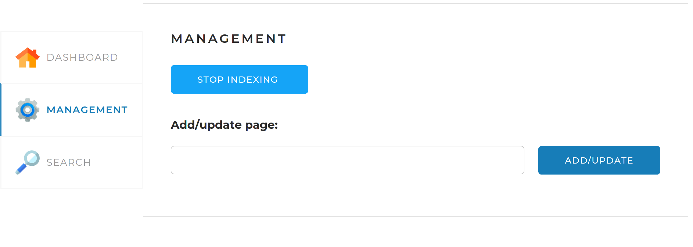

# Search Engine
## Поисковый движок, итоговый проект курса «Java-разработчик»

Принципы работы поискового движка:
1.  В конфигурационном файле перед запуском приложения задаются
    адреса сайтов, по которым движок должен осуществлять поиск.
2. Поисковый движок должен самостоятельно обходить все страницы заданных сайтов и индексировать их (создавать так называемый индекс) так, чтобы потом находить наиболее релевантные страницы по любому поисковому запросу.
3.  Пользователь присылает запрос через API движка. Запрос — это набор слов, по которым нужно найти страницы сайта.
4. Запрос определённым образом трансформируется в список слов, переведённых в базовую форму. Например, для существительных — именительный падеж, единственное число.
5.  В индексе ищутся страницы, на которых встречаются все эти слова.
6.  Результаты поиска ранжируются, сортируются и отдаются пользователю.

## Стэк
* Java 20
* Spring boot
* MySQL 8
* Lucene
* jsoup

## Инструкция запуска и работы программы
### Заполнение application.yaml
#### Подключение MySQL 8
1. Ввести порт
2. Ввести имя пользователя
3. Ввести пароль
4. Указать параметр "create", для первого запуска, для последующих запусков программы потребуется изменить параметр на "update"
#### Заполнение раздела, со списком сайтов для индексации

### Работа программы
1. После запуска приложения, необходимо открыть его через браузер по адресу: http://localhost:8080/
2. Откроется страница следующего вида:
   
   Dashboard. Эта вкладка открывается по умолчанию. На ней
   отображается общая статистика по всем сайтам, а также детальная статистика и статус по каждому из сайтов (статистика, получаемая по запросу /api/statistics).
3. Для запуска индексации сайтов указанных в application.yaml, нужно перейти на вкладку "Management"
   
   На этой вкладке находятся инструменты управления поисковым движком — запуск и остановка полной индексации (переиндексации).
   "Start Indexing" - запускает индексацию (переиндексации) сайтов.
   
   Для преждевременной остановки необходимо нажать кнопку "Stop Indexing". Остановка произойдет через не продолжительное количество времени, т.к. должны выполнится оставшиеся задачи у ForkJoinPool.
4. Добавить (обновить) отдельную страницу по ссылке:
   
   Для этого нужно ввести в поле адрес нужной страницы, и нажать кнопку "ADD/UPDATE"
   
5. Поиск по индексированным сайтам происходит на вкладке "Search"
   
   Поиск можно осуществить как по всем проиндексированным сайтам так и по отдельному сайту
   
   Если выбрать сайт который не проиндексирован, то программа выдаст ошибку
   
   Поиск по всем сайтам
   
   Поиск по конкретному сайту
   
   